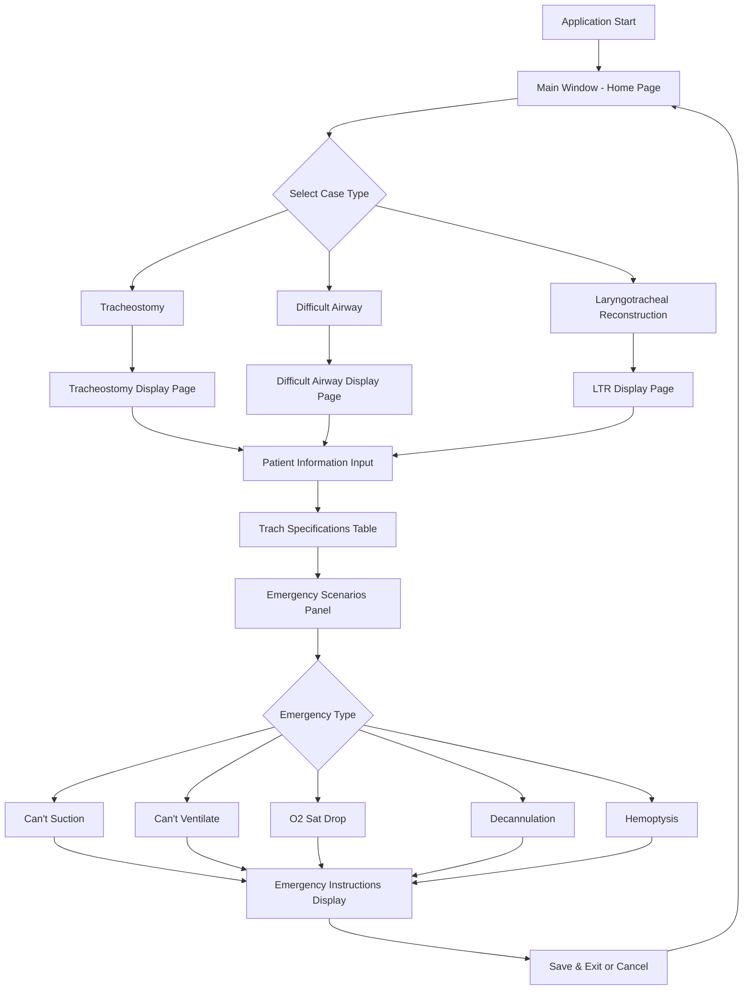
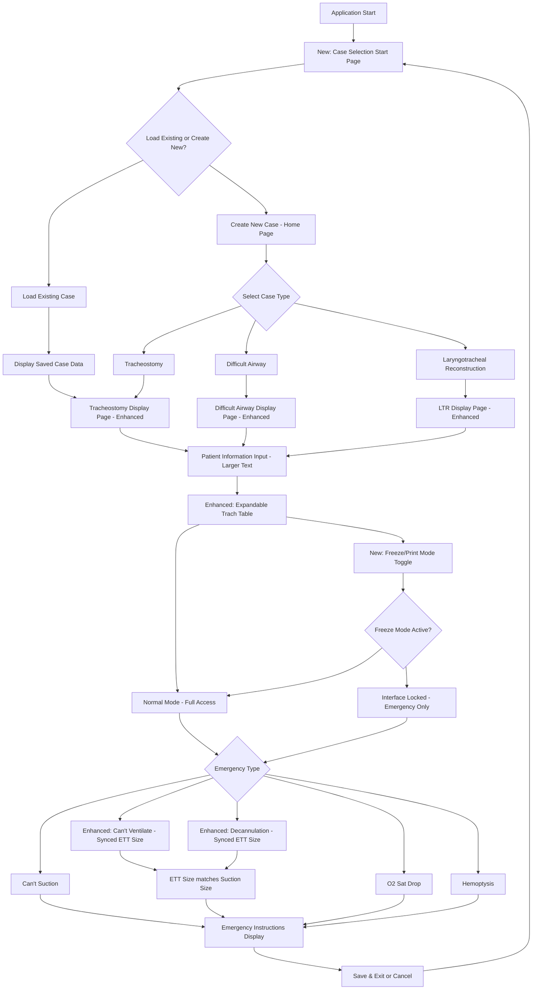

# Safe Airway Application Workflow

Workflow of the Safe Airway Qt C++ application.

## Current Application Structure

## Enhanced Workflow with New Features

## Key Components

### 1. Main Application Entry
- **File**: `main.cpp`
- **Purpose**: Application initialization and main window setup

### 2. Main Window Controller
- **Files**: `mainwindow.h`, `mainwindow.cpp`
- **Purpose**: Core application logic, emergency scenario handling, UI management

### 3. User Interface
- **File**: `mainwindow.ui`
- **Purpose**: Qt Designer UI layout with stacked widgets for different pages

### 4. Emergency Scenarios
- **Current Types**: Can't Suction, Can't Ventilate, O2 Sat Drop, Decannulation, Hemoptysis
- **Enhancement**: ETT size synchronization with suction size for specific scenarios

## New Features to Implement

### 1. Start Page for Case Selection
- Add new page before main case type selection
- Options: "Load Existing Case" and "Create New Case"
- File management for saved cases

### 2. Enhanced Text Size
- Increase font sizes throughout application
- Optimize for 11.3" x 8.2" screen dimensions

### 3. Expandable Table
- Modify table to fill horizontal space instead of truncating
- Implement proper column sizing and content wrapping

### 4. ETT Size Synchronization
- Link "6.0 endotracheal tube" text in emergency scenarios with suction size field
- Apply to "Can't Ventilate" and "Decannulation" scenarios

### 5. Freeze/Print Mode
- Add toggle to lock interface except emergency scenarios
- Prevent patient interference with critical data
- Maintain emergency scenario accessibility

## Technical Implementation Notes

- **Framework**: Qt 6 with C++17
- **UI Design**: Qt Designer (.ui files)
- **Build System**: qmake (.pro files)
- **Resource Management**: Qt Resource System (.qrc files) 